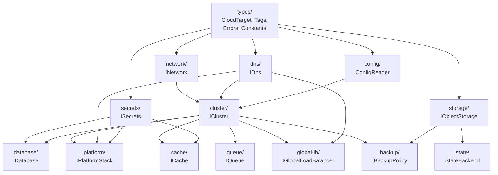

# Component Diagram & Dependency Graph

**Date:** 2026-02-13
**Status:** Design (REY-84)

---

## Package Structure

```
@reyemtech/nimbus
├── src/
│   ├── types/                    # Shared types, interfaces, constants
│   │   ├── cloud-target.ts       # CloudProvider, CloudTarget, CloudArg, ResolvedCloudTarget
│   │   ├── tags.ts               # IRequiredTags, normalizeTags()
│   │   ├── errors.ts             # Custom error classes
│   │   └── index.ts              # Barrel export
│   │
│   ├── factories/                # Cloud-agnostic factory functions (async + dynamic imports)
│   │   ├── network.ts            # createNetwork() → dispatches to AWS/Azure
│   │   ├── cluster.ts            # createCluster() → dispatches to EKS/AKS
│   │   ├── dns.ts                # createDns() → dispatches to Route 53/Azure DNS
│   │   ├── secrets.ts            # createSecrets() → dispatches to Secrets Manager/Key Vault
│   │   ├── state.ts              # createStateBackend() → dispatches to S3/Azure Blob
│   │   ├── types.ts              # IProviderOptions, IAwsProviderOptions, IAzureProviderOptions
│   │   └── index.ts              # Barrel export
│   │
│   ├── aws/                      # AWS implementations (loaded dynamically)
│   │   ├── network.ts            # VPC + subnets + NAT (managed/fck-nat)
│   │   ├── eks-cluster.ts        # EKS + Auto Mode
│   │   ├── dns.ts                # Route 53 hosted zone
│   │   ├── secrets.ts            # AWS Secrets Manager
│   │   ├── state.ts              # S3 + DynamoDB locking + cross-region replication
│   │   └── index.ts              # Barrel export
│   │
│   ├── azure/                    # Azure implementations (loaded dynamically)
│   │   ├── network.ts            # VNet + subnets + NAT Gateway + NSG
│   │   ├── aks-cluster.ts        # AKS + virtual nodes
│   │   ├── dns.ts                # Azure DNS Zone
│   │   ├── secrets.ts            # Azure Key Vault
│   │   ├── state.ts              # StorageAccount + BlobContainer + GRS
│   │   └── index.ts              # Barrel export
│   │
│   ├── cluster/                  # ICluster interface definitions
│   │   └── index.ts
│   │
│   ├── network/                  # INetwork interface + CIDR utilities
│   │   ├── cidr-utils.ts         # validateCidr(), buildCidrMap(), autoOffsetCidrs()
│   │   └── index.ts
│   │
│   ├── dns/                      # IDns interface definitions
│   │   └── index.ts
│   │
│   ├── secrets/                  # ISecrets interface definitions
│   │   └── index.ts
│   │
│   ├── state/                    # IStateBackend interface definitions
│   │   ├── interfaces.ts         # StateBackendType, IStateBackendConfig, IStateBackend
│   │   └── index.ts              # Barrel export
│   │
│   ├── database/                 # IDatabase interface definitions (future)
│   │   └── index.ts
│   │
│   ├── cache/                    # ICache interface definitions (future)
│   │   └── index.ts
│   │
│   ├── storage/                  # IObjectStorage interface definitions (future)
│   │   └── index.ts
│   │
│   ├── queue/                    # IQueue interface definitions (future)
│   │   └── index.ts
│   │
│   ├── platform/                 # IPlatformStack
│   │   ├── components/
│   │   │   ├── traefik.ts        # Traefik Helm component
│   │   │   ├── argocd.ts         # ArgoCD Helm component
│   │   │   ├── cert-manager.ts   # cert-manager Helm component
│   │   │   ├── external-dns.ts   # External DNS Helm component
│   │   │   ├── vault.ts          # Vault Helm component
│   │   │   ├── external-secrets.ts # ESO Helm component
│   │   │   └── oauth2-proxy.ts   # OAuth2 Proxy (optional)
│   │   ├── platform-stack.ts     # PlatformStack class
│   │   ├── factory.ts            # createPlatformStack()
│   │   └── index.ts
│   │
│   ├── global-lb/                # IGlobalLoadBalancer
│   │   ├── route53-glb.ts        # Route 53 health-checked routing
│   │   ├── cloudflare-glb.ts     # Cloudflare Load Balancing
│   │   ├── traffic-manager.ts    # Azure Traffic Manager
│   │   ├── factory.ts            # createGlobalLoadBalancer()
│   │   └── index.ts
│   │
│   ├── backup/                   # Backup abstraction (future)
│   │   ├── velero.ts             # Velero Helm + config
│   │   ├── factory.ts            # createBackupPolicy()
│   │   └── index.ts
│   │
│   ├── utils/                    # Shared utilities
│   │   ├── provider-loader.ts    # Dynamic provider import with helpful error messages
│   │   └── index.ts              # Barrel export
│   │
│   ├── config/                   # Pulumi config file helpers
│   │   ├── config-reader.ts      # Read any-cloud config from Pulumi.<stack>.yaml
│   │   └── index.ts
│   │
│   ├── cli.ts                    # CLI helper (npx @reyemtech/nimbus install/check)
│   └── index.ts                  # Package root barrel export (types + factories only)
│
├── tests/
│   ├── unit/
│   │   ├── types/
│   │   ├── cluster/aws/
│   │   ├── cluster/azure/
│   │   ├── network/
│   │   ├── dns/
│   │   ├── secrets/
│   │   ├── database/
│   │   ├── cache/
│   │   ├── storage/
│   │   ├── queue/
│   │   ├── platform/
│   │   └── global-lb/
│   └── integration/
│       └── multi-cloud/
│
├── examples/
│   ├── simple-aws/               # Single AWS cluster
│   ├── simple-azure/             # Single Azure cluster
│   ├── multi-cloud/              # AWS + Azure active-active
│   └── metrixgroup-migration/    # Real MetrixGroup to Pulumi
│
└── docs/
    ├── audit/                    # Environment audits (REY-83)
    └── architecture/             # This document (REY-84)
```

---

## Component Dependency Graph



### Dependency Rules

1. **types/** — no dependencies (leaf)
2. **utils/** — no dependencies (leaf)
3. **network/** — depends on types/
4. **dns/** — depends on types/
5. **secrets/** — depends on types/
6. **state/** — depends on types/ (S3/Azure Blob state storage)
7. **cluster/** — depends on types/, network/ (optional), dns/ (for node registration)
8. **database/** — depends on types/, cluster/ (for operator mode), secrets/
9. **cache/** — depends on types/, cluster/ (for Helm mode), secrets/
10. **storage/** — depends on types/
11. **queue/** — depends on types/, cluster/ (for operator mode)
12. **platform/** — depends on types/, cluster/, dns/, secrets/
13. **global-lb/** — depends on types/, cluster/, dns/
14. **backup/** — depends on types/, cluster/, storage/
15. **factories/** — depends on types/, aws/, azure/ (via dynamic imports)
16. **config/** — depends on types/ (reads Pulumi config)
17. **cli.ts** — standalone (uses child_process + dynamic imports)

### Dynamic Provider Loading

The `factories/` directory uses async dynamic imports (`await import("../aws/index.js")`) so that only the targeted cloud provider SDK loads at runtime. The `utils/provider-loader.ts` helper wraps `import()` with clear error messages when a provider SDK is missing:

```
Cloud provider "aws" requires: @pulumi/aws
Run: npm install @pulumi/aws
Or:  npx @reyemtech/nimbus install aws
```

The root `src/index.ts` only re-exports **types** and **factory functions** — no static imports of `./aws` or `./azure`. Users who want direct provider access can use subpath imports: `import { createAwsNetwork } from "@reyemtech/nimbus/aws"`.

---

## Cloud Provider Implementation Matrix

| Component | AWS | Azure | GCP | In-Cluster |
|-----------|-----|-------|-----|------------|
| **Cluster** | EKS (+ Auto Mode) | AKS (+ ACI) | GKE | — |
| **Network** | VPC + subnets | VNet + subnets | VPC + subnets | — |
| **DNS** | Route 53 | Azure DNS | Cloud DNS | — |
| **Secrets** | Secrets Manager | Key Vault | Secret Manager | Vault |
| **Database** | RDS/Aurora | Azure Database | Cloud SQL | PXC, CNPG, MariaDB Op |
| **Cache** | ElastiCache | Azure Cache | Memorystore | Redis Helm |
| **Storage** | S3 | Blob Storage | GCS | — |
| **Queue** | SQS | Service Bus | Pub/Sub | NATS, RabbitMQ |
| **Global LB** | Route 53 health checks | Traffic Manager | — | — |

### Phase Implementation Order

| Phase | Components | REY Issues |
|-------|-----------|------------|
| 1 - Foundation | types/, config/ | REY-85 |
| 2 - AWS | cluster/aws, network/aws, dns/aws, secrets/aws | REY-86 |
| 3 - Azure | cluster/azure, network/azure, dns/azure, secrets/azure | REY-87 |
| 4 - Platform | platform/ (all components) | REY-88 |
| 5 - Multi-cloud | global-lb/, cidr-utils, multi-cloud factories | REY-89 |
| 6 - Extended | database/, cache/, storage/, queue/, state/, backup/ | REY-93-106 |

---

## Error Handling Strategy

```typescript
/** Base error for all nimbus errors */
class AnyCloudError extends Error {
  readonly code: string;
  constructor(message: string, code: string) { ... }
}

/** Cloud-specific validation errors */
class CloudValidationError extends AnyCloudError { ... }

/** CIDR overlap or invalid CIDR */
class CidrError extends AnyCloudError { ... }

/** Unsupported cloud/feature combination */
class UnsupportedFeatureError extends AnyCloudError { ... }

/** Configuration errors */
class ConfigError extends AnyCloudError { ... }
```

### Discriminated Union for Cloud-Specific Config

```typescript
/** AWS-specific cluster extensions */
interface IEksClusterConfig {
  readonly provider: "aws";
  readonly autoMode?: boolean;
  readonly fargateProfiles?: ReadonlyArray<IFargateProfile>;
}

/** Azure-specific cluster extensions */
interface IAksClusterConfig {
  readonly provider: "azure";
  readonly virtualNodes?: boolean;
  readonly azureCni?: boolean;
}

/** GCP-specific cluster extensions */
interface IGkeClusterConfig {
  readonly provider: "gcp";
  readonly autopilot?: boolean;
}

/** Union type for provider-specific config */
type ProviderClusterConfig = IEksClusterConfig | IAksClusterConfig | IGkeClusterConfig;

/** Exhaustive switch helper */
function assertNever(x: never): never {
  throw new UnsupportedFeatureError(`Unsupported provider: ${x}`, "UNSUPPORTED_PROVIDER");
}
```

---

## Configuration Resolution Order

1. **Explicit parameter** (highest priority)
2. **Pulumi config file** (`Pulumi.<stack>.yaml`)
3. **Environment variable** (`ANY_CLOUD_DEFAULT_REGION`, etc.)
4. **Built-in default** (`DEFAULT_REGIONS`, etc.)

```typescript
function resolveCloudTarget(cloud: CloudArg): ResolvedCloudTarget | ReadonlyArray<ResolvedCloudTarget> {
  // 1. If string → look up config file for region, fallback to DEFAULT_REGIONS
  // 2. If CloudTarget → use region if present, fallback to DEFAULT_REGIONS
  // 3. If array → resolve each element recursively
}
```
