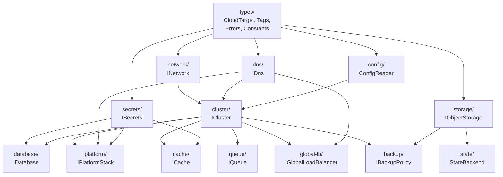

# Component Diagram & Dependency Graph

**Date:** 2026-02-13
**Status:** Design (REY-84)

---

## Package Structure

```
@reyemtech/pulumi-any-cloud
├── src/
│   ├── types/                    # Shared types, interfaces, constants
│   │   ├── cloud-target.ts       # CloudProvider, CloudTarget, CloudArg, ResolvedCloudTarget
│   │   ├── tags.ts               # IRequiredTags, normalizeTags()
│   │   ├── errors.ts             # Custom error classes
│   │   └── index.ts              # Barrel export
│   │
│   ├── cluster/                  # ICluster implementations
│   │   ├── aws/
│   │   │   └── eks-cluster.ts    # EksCluster (EKS + Auto Mode)
│   │   ├── azure/
│   │   │   └── aks-cluster.ts    # AksCluster (AKS + virtual nodes)
│   │   ├── gcp/
│   │   │   └── gke-cluster.ts    # GkeCluster (future)
│   │   ├── factory.ts            # createCluster() factory + overloads
│   │   └── index.ts
│   │
│   ├── network/                  # INetwork implementations
│   │   ├── aws/
│   │   │   └── aws-network.ts    # VPC + subnets + NAT (managed/fck-nat)
│   │   ├── azure/
│   │   │   └── azure-network.ts  # VNet + subnets + NAT Gateway + NSG
│   │   ├── gcp/
│   │   │   └── gcp-network.ts    # VPC + subnets (future)
│   │   ├── cidr-utils.ts         # validateCidr(), generateCidrMap()
│   │   ├── factory.ts            # createNetwork()
│   │   └── index.ts
│   │
│   ├── dns/                      # IDns implementations
│   │   ├── aws/
│   │   │   └── route53-dns.ts    # Route 53 hosted zone
│   │   ├── azure/
│   │   │   └── azure-dns.ts      # Azure DNS Zone
│   │   ├── gcp/
│   │   │   └── cloud-dns.ts      # Cloud DNS (future)
│   │   ├── factory.ts            # createDns()
│   │   └── index.ts
│   │
│   ├── secrets/                  # ISecrets implementations
│   │   ├── aws/
│   │   │   └── aws-secrets.ts    # AWS Secrets Manager
│   │   ├── azure/
│   │   │   └── azure-secrets.ts  # Azure Key Vault
│   │   ├── gcp/
│   │   │   └── gcp-secrets.ts    # GCP Secret Manager (future)
│   │   ├── vault/
│   │   │   └── vault-secrets.ts  # HashiCorp Vault (in-cluster)
│   │   ├── factory.ts            # createSecrets()
│   │   └── index.ts
│   │
│   ├── database/                 # IDatabase implementations
│   │   ├── aws/
│   │   │   └── rds-database.ts   # RDS/Aurora
│   │   ├── azure/
│   │   │   └── azure-database.ts # Azure Database flexible server
│   │   ├── operators/
│   │   │   ├── pxc-database.ts   # Percona XtraDB Cluster
│   │   │   ├── cnpg-database.ts  # CloudNativePG
│   │   │   └── mariadb-database.ts # MariaDB Operator
│   │   ├── factory.ts            # createDatabase()
│   │   └── index.ts
│   │
│   ├── cache/                    # ICache implementations
│   │   ├── aws/
│   │   │   └── elasticache.ts    # ElastiCache
│   │   ├── azure/
│   │   │   └── azure-cache.ts    # Azure Cache for Redis
│   │   ├── helm/
│   │   │   └── redis-helm.ts     # Bitnami Redis Helm chart
│   │   ├── factory.ts            # createCache()
│   │   └── index.ts
│   │
│   ├── storage/                  # IObjectStorage implementations
│   │   ├── aws/
│   │   │   └── s3-storage.ts     # S3
│   │   ├── azure/
│   │   │   └── blob-storage.ts   # Azure Blob
│   │   ├── gcp/
│   │   │   └── gcs-storage.ts    # GCS (future)
│   │   ├── factory.ts            # createObjectStorage()
│   │   └── index.ts
│   │
│   ├── queue/                    # IQueue implementations
│   │   ├── aws/
│   │   │   └── sqs-queue.ts      # SQS
│   │   ├── azure/
│   │   │   └── servicebus-queue.ts # Service Bus
│   │   ├── operators/
│   │   │   └── nats-queue.ts     # NATS (in-cluster)
│   │   ├── factory.ts            # createQueue()
│   │   └── index.ts
│   │
│   ├── platform/                 # IPlatformStack
│   │   ├── components/
│   │   │   ├── traefik.ts        # Traefik Helm component
│   │   │   ├── argocd.ts         # ArgoCD Helm component
│   │   │   ├── cert-manager.ts   # cert-manager Helm component
│   │   │   ├── external-dns.ts   # External DNS Helm component
│   │   │   ├── vault.ts          # Vault Helm component
│   │   │   ├── external-secrets.ts # ESO Helm component
│   │   │   └── oauth2-proxy.ts   # OAuth2 Proxy (optional)
│   │   ├── platform-stack.ts     # PlatformStack class
│   │   ├── factory.ts            # createPlatformStack()
│   │   └── index.ts
│   │
│   ├── global-lb/                # IGlobalLoadBalancer
│   │   ├── route53-glb.ts        # Route 53 health-checked routing
│   │   ├── cloudflare-glb.ts     # Cloudflare Load Balancing
│   │   ├── traffic-manager.ts    # Azure Traffic Manager
│   │   ├── factory.ts            # createGlobalLoadBalancer()
│   │   └── index.ts
│   │
│   ├── state/                    # State backend
│   │   ├── factory.ts            # createStateBackend()
│   │   └── index.ts
│   │
│   ├── backup/                   # Backup abstraction
│   │   ├── velero.ts             # Velero Helm + config
│   │   ├── factory.ts            # createBackupPolicy()
│   │   └── index.ts
│   │
│   ├── config/                   # Pulumi config file helpers
│   │   ├── config-reader.ts      # Read any-cloud config from Pulumi.<stack>.yaml
│   │   └── index.ts
│   │
│   └── index.ts                  # Package root barrel export
│
├── tests/
│   ├── unit/
│   │   ├── types/
│   │   ├── cluster/aws/
│   │   ├── cluster/azure/
│   │   ├── network/
│   │   ├── dns/
│   │   ├── secrets/
│   │   ├── database/
│   │   ├── cache/
│   │   ├── storage/
│   │   ├── queue/
│   │   ├── platform/
│   │   └── global-lb/
│   └── integration/
│       └── multi-cloud/
│
├── examples/
│   ├── simple-aws/               # Single AWS cluster
│   ├── simple-azure/             # Single Azure cluster
│   ├── multi-cloud/              # AWS + Azure active-active
│   └── metrixgroup-migration/    # Real MetrixGroup to Pulumi
│
└── docs/
    ├── audit/                    # Environment audits (REY-83)
    └── architecture/             # This document (REY-84)
```

---

## Component Dependency Graph



### Dependency Rules

1. **types/** — no dependencies (leaf)
2. **network/** — depends on types/
3. **dns/** — depends on types/
4. **secrets/** — depends on types/
5. **cluster/** — depends on types/, network/ (optional), dns/ (for node registration)
6. **database/** — depends on types/, cluster/ (for operator mode), secrets/
7. **cache/** — depends on types/, cluster/ (for Helm mode), secrets/
8. **storage/** — depends on types/
9. **queue/** — depends on types/, cluster/ (for operator mode)
10. **platform/** — depends on types/, cluster/, dns/, secrets/
11. **global-lb/** — depends on types/, cluster/, dns/
12. **backup/** — depends on types/, cluster/, storage/
13. **state/** — depends on types/, storage/
14. **config/** — depends on types/ (reads Pulumi config)

---

## Cloud Provider Implementation Matrix

| Component | AWS | Azure | GCP | In-Cluster |
|-----------|-----|-------|-----|------------|
| **Cluster** | EKS (+ Auto Mode) | AKS (+ ACI) | GKE | — |
| **Network** | VPC + subnets | VNet + subnets | VPC + subnets | — |
| **DNS** | Route 53 | Azure DNS | Cloud DNS | — |
| **Secrets** | Secrets Manager | Key Vault | Secret Manager | Vault |
| **Database** | RDS/Aurora | Azure Database | Cloud SQL | PXC, CNPG, MariaDB Op |
| **Cache** | ElastiCache | Azure Cache | Memorystore | Redis Helm |
| **Storage** | S3 | Blob Storage | GCS | — |
| **Queue** | SQS | Service Bus | Pub/Sub | NATS, RabbitMQ |
| **Global LB** | Route 53 health checks | Traffic Manager | — | — |

### Phase Implementation Order

| Phase | Components | REY Issues |
|-------|-----------|------------|
| 1 - Foundation | types/, config/ | REY-85 |
| 2 - AWS | cluster/aws, network/aws, dns/aws, secrets/aws | REY-86 |
| 3 - Azure | cluster/azure, network/azure, dns/azure, secrets/azure | REY-87 |
| 4 - Platform | platform/ (all components) | REY-88 |
| 5 - Multi-cloud | global-lb/, cidr-utils, multi-cloud factories | REY-89 |
| 6 - Extended | database/, cache/, storage/, queue/, state/, backup/ | REY-93-106 |

---

## Error Handling Strategy

```typescript
/** Base error for all pulumi-any-cloud errors */
class AnyCloudError extends Error {
  readonly code: string;
  constructor(message: string, code: string) { ... }
}

/** Cloud-specific validation errors */
class CloudValidationError extends AnyCloudError { ... }

/** CIDR overlap or invalid CIDR */
class CidrError extends AnyCloudError { ... }

/** Unsupported cloud/feature combination */
class UnsupportedFeatureError extends AnyCloudError { ... }

/** Configuration errors */
class ConfigError extends AnyCloudError { ... }
```

### Discriminated Union for Cloud-Specific Config

```typescript
/** AWS-specific cluster extensions */
interface IEksClusterConfig {
  readonly provider: "aws";
  readonly autoMode?: boolean;
  readonly fargateProfiles?: ReadonlyArray<IFargateProfile>;
}

/** Azure-specific cluster extensions */
interface IAksClusterConfig {
  readonly provider: "azure";
  readonly virtualNodes?: boolean;
  readonly azureCni?: boolean;
}

/** GCP-specific cluster extensions */
interface IGkeClusterConfig {
  readonly provider: "gcp";
  readonly autopilot?: boolean;
}

/** Union type for provider-specific config */
type ProviderClusterConfig = IEksClusterConfig | IAksClusterConfig | IGkeClusterConfig;

/** Exhaustive switch helper */
function assertNever(x: never): never {
  throw new UnsupportedFeatureError(`Unsupported provider: ${x}`, "UNSUPPORTED_PROVIDER");
}
```

---

## Configuration Resolution Order

1. **Explicit parameter** (highest priority)
2. **Pulumi config file** (`Pulumi.<stack>.yaml`)
3. **Environment variable** (`ANY_CLOUD_DEFAULT_REGION`, etc.)
4. **Built-in default** (`DEFAULT_REGIONS`, etc.)

```typescript
function resolveCloudTarget(cloud: CloudArg): ResolvedCloudTarget | ReadonlyArray<ResolvedCloudTarget> {
  // 1. If string → look up config file for region, fallback to DEFAULT_REGIONS
  // 2. If CloudTarget → use region if present, fallback to DEFAULT_REGIONS
  // 3. If array → resolve each element recursively
}
```
