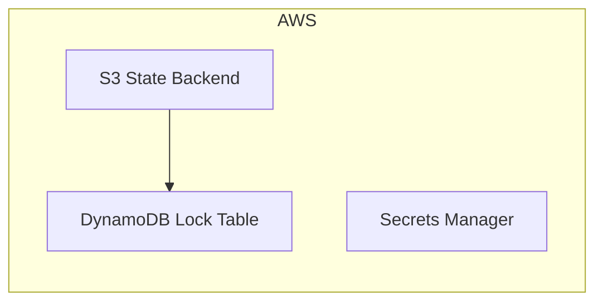

# Minimal AWS Example

Deploys a lightweight AWS stack with state management and secrets — no cluster required.

## Components

- **State Backend** — S3 bucket with versioning, encryption, and DynamoDB locking
- **Secrets** — AWS Secrets Manager for sensitive configuration

## Architecture



## Usage

```bash
pulumi new typescript
npm install @reyemtech/nimbus @pulumi/aws
cp index.ts your-project/index.ts
pulumi up
```
