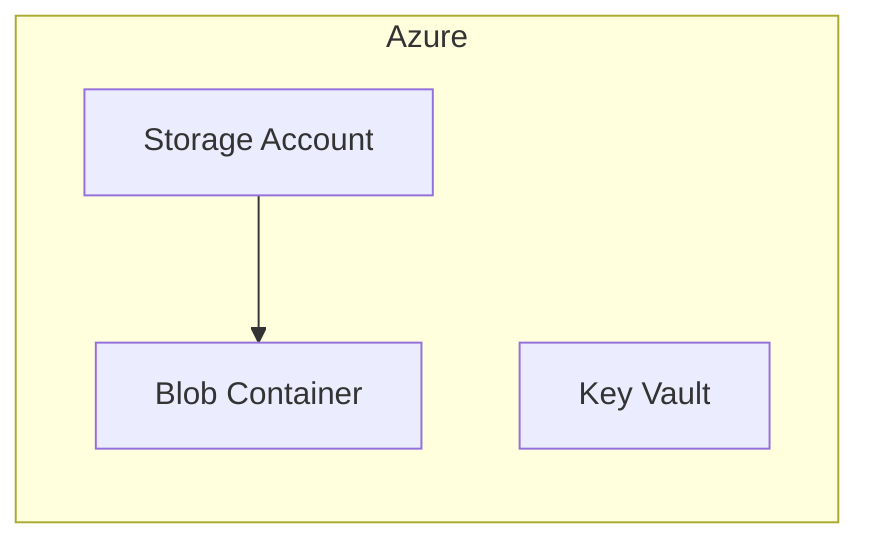

# Minimal Azure Example

Deploys a lightweight Azure stack with state management and secrets — no cluster required.

## Components

- **State Backend** — Azure Blob Storage with versioning and encryption
- **Secrets** — Azure Key Vault for sensitive configuration

## Architecture



## Usage

```bash
pulumi new typescript
npm install @reyemtech/nimbus @pulumi/azure-native
cp index.ts your-project/index.ts
pulumi up
```
