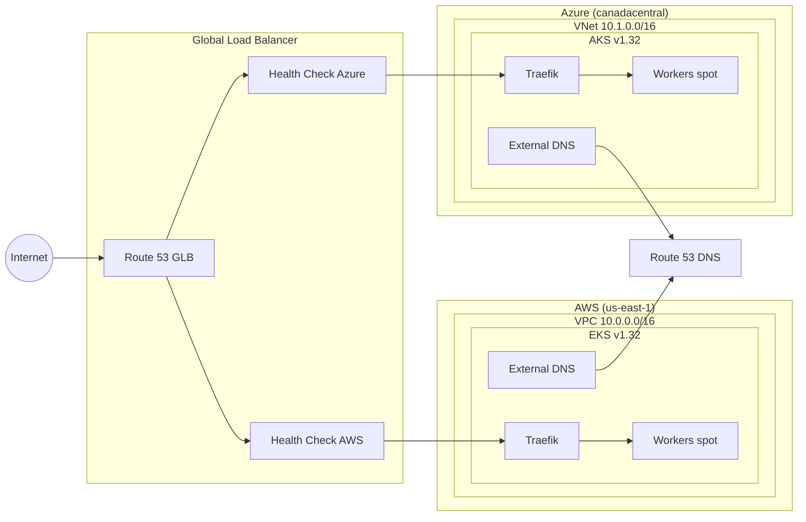

# Multi-Cloud Example

Deploys an active-active stack across AWS and Azure with a Global Load Balancer.

## Components

- **Networks** — Auto-offset CIDRs (AWS: 10.0.0.0/16, Azure: 10.1.0.0/16)
- **Clusters** — EKS + AKS, same config, auto-matched to networks by provider
- **DNS** — Route 53 hosted zone
- **Platform** — Identical Helm stack deployed to both clusters
- **GLB** — Route 53 weighted routing with health checks across both clusters

## Architecture



## How It Works

1. **Factory dispatch** — `createNetwork("prod", { cloud: ["aws", "azure"] })` creates both VPC and VNet in one call
2. **CIDR auto-offset** — Second cloud auto-increments to `10.1.0.0/16` to avoid overlaps
3. **Provider matching** — `createCluster(...)` matches each cluster to its network by provider
4. **GLB** — Route 53 weighted records distribute traffic 50/50, health checks failover automatically

## Usage

```bash
pulumi new typescript
npm install @reyemtech/nimbus @pulumi/aws @pulumi/azure-native @pulumi/kubernetes
cp index.ts your-project/index.ts
pulumi up
```
