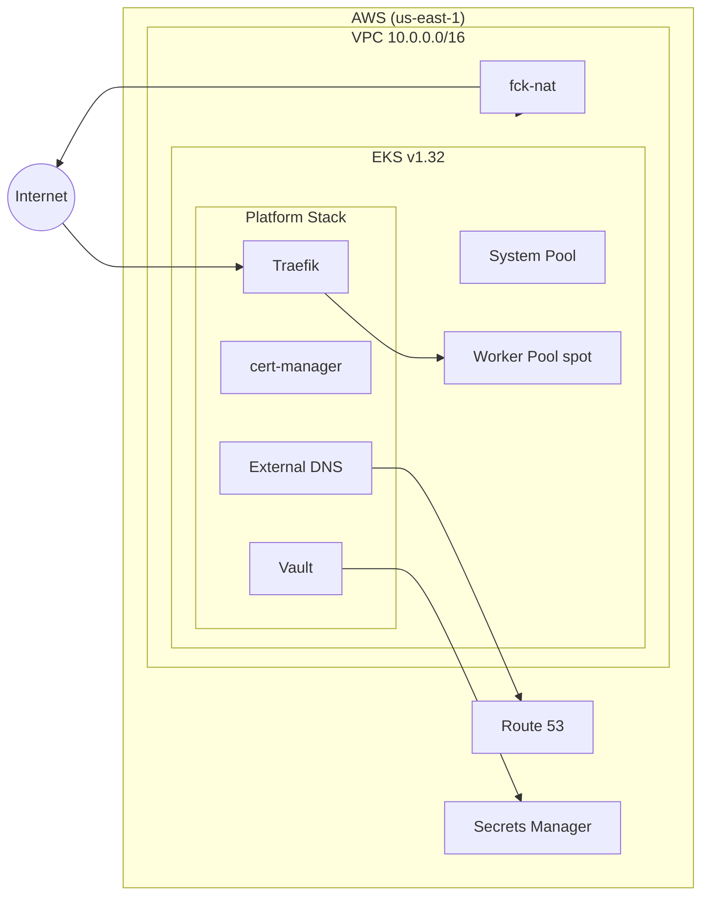

# Single-Cloud AWS Example

Deploys a full production stack on AWS using the nimbus factory API.

## Components

- **Network** — VPC with public/private subnets and fck-nat (~$3/mo)
- **Cluster** — EKS with Auto Mode, system + spot worker pools
- **DNS** — Route 53 hosted zone with A and CNAME records
- **Secrets** — AWS Secrets Manager for database credentials
- **Platform** — Traefik, cert-manager, External DNS, Vault via Helm

## Architecture



## Usage

```bash
pulumi new typescript
npm install @reyemtech/nimbus @pulumi/aws @pulumi/kubernetes
cp index.ts your-project/index.ts
pulumi up
```
