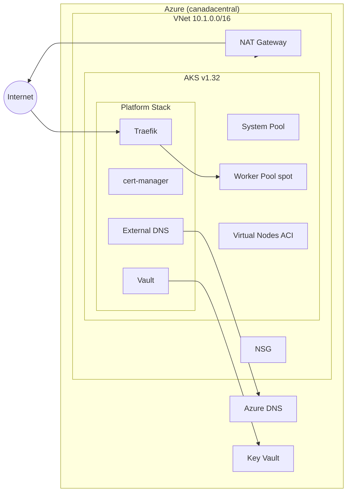

# Single-Cloud Azure Example

Deploys a full production stack on Azure using the nimbus factory API.

## Components

- **Network** — VNet with public/private subnets, NAT Gateway, and NSG
- **Cluster** — AKS with system + spot worker pools and virtual nodes (ACI)
- **DNS** — Azure DNS Zone with A and CNAME records
- **Secrets** — Azure Key Vault with RBAC authorization
- **Platform** — Traefik, cert-manager, External DNS, Vault via Helm

## Architecture



## Usage

```bash
pulumi new typescript
npm install @reyemtech/nimbus @pulumi/azure-native @pulumi/kubernetes
cp index.ts your-project/index.ts
pulumi up
```
